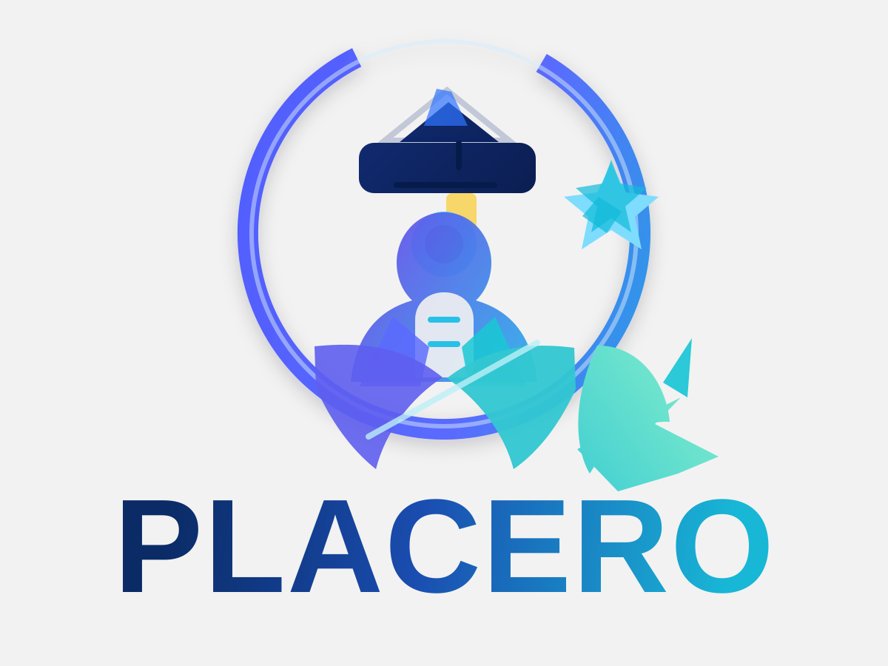

# PLACERO


**Prepare. Prove. Practice. Get Placement Ready.**

PLACERO is a full-stack student placement preparation platform and career readiness operating system. Built specifically for college engineering students (Chemical, Mechanical, Electrical, ECE, CSE/IT...)

---

## 🌟 Key Features

1. **Company War Room**:
   - Deep-dive verified preparation intelligence for 14+ premier recruiters (Reliance Industries, Tata Motors, L&T, Siemens, Texas Instruments, Dow Chemicals, Caterpillar, Schneider Electric, Google, ...)
   - Verified audit date stamp (*"Information last verified: YYYY-MM-DD"*), official career portal links, and engineering blogs.
   - Skill Radars with benchmark meters, 4-Week Roadmaps, and campus interview viva questions.

2. **Proof Lab & BOM Engine**:
   - Converts textbook knowledge into verifiable engineering evidence (CAD models, Aspen Plus simulations, code repositories, PFDs/P&IDs).
   - Built-in **Bill of Materials (BOM) & Prototype Cost Engine** for hardware and pilot projects.
   - **AI Project Evidence Scorer**: Evaluates projects across Technical Depth, Practicality, Documentation, Quantifiable Results, and Reproducibility.

3. **Voice Mock Interview & STAR-L Trainer**:
   - Real microphone recording with HTML5 `MediaRecorder` API and live waveform animations.
   - Automatic filler word detection (`um`, `like`, `actually`, `basically`) with frequency tracking.
   - Speaking pace (WPM) and duration monitoring.
   - **STAR-L Structure Analysis** (Situation, Task, Action, Result, Learning).
   - "Compare Attempt 1 vs Attempt 2" tracking for continuous improvement.

4. **Resume "So What?" Bullet Lab**:
   - Converts passive bullets into high-impact accomplishments using:
     `ACTION + CONTEXT + QUANTIFIABLE RESULT + BUSINESS/USER IMPACT`.
   - Never fabricates numbers: prompts students with sharp questions to extract true parameters.

5. **Core Engineer Mode**:
   - Branch-specific calculators and simulation tools:
     - **Centrifugal Pump NPSH_a vs NPSH_r Solver** with cavitation risk alerts.
     - **GD&T True Position & Bonus Tolerance (ASME Y14.5)**.
     - **Distillation Column Minimum Stages (Fenske Equation)**.
     - **Industrial Datasheet Decoder** with AI boundary & pinout querying.

6. **Mistake Vault & Failure Pattern Lab**:
   - Logs what went wrong, correct principles, and improved deliveries.
   - Automatically detects recurring patterns (*"Top failure: Not stating boundary assumptions"*).

7. **Reverse Audit Lab & 100-Day Plan Generator**:
   - Reverse-engineers plant bottlenecks and proposes verified solutions.
   - Generates customizable 30-60-90 / 100-Day Executive Plans for GET onboarding with PDF/print export.

8. **RCA & 5-Whys Simulator**:
   - Interactive causal reasoning tree evaluated by AI against systemic failure modes.

9. **Alumni Intelligence**:
   - Verified insights from campus recruits, interview surprises, and instant LinkedIn outreach message generator.

10. **Admin Panel**:
    - Manage companies, mark information verified with 1 click, and add custom viva questions.

11. **1-Click Demo Mode**:
    - Preloaded with **Alex Student** (Chemical Engineering, targeting Reliance Industries & L&T, 78% readiness, 7-day streak) for instant judging and demonstration.

---

## 🛠 Tech Stack

- **Frontend**: React 19, TypeScript, Tailwind CSS, Lucide Icons, Canvas Confetti.
- **Backend**: Node.js, Express, tsx.
- **AI Engine**: Google Gemini API (`@google/genai`) using `gemini-3.8-flash` exclusively on the server side.
- **Data & Storage**: Clean modular in-memory database with realistic seed data and REST API endpoints.

---

## 🚀 Getting Started

### Prerequisites
- Node.js (v18+)
- npm

### Installation

```bash
# Clone the repository and install dependencies
npm install

# Start the full-stack development server
npm run dev
```

The application runs on `http://localhost:3000`.

### Environment Variables
Configure your `.env` file (see `.env.example`):

```bash
GEMINI_API_KEY="your-gemini-api-key"
PORT=3000
```

*Note: In Google AI Studio Build, the Gemini API key is automatically injected at runtime.*

---

## 🏗 Architecture & Code Structure

```
├── server.ts                  # Server entry point mounting API routes and Vite middleware
├── server/
│   ├── api/
│   │   └── routes.ts          # Comprehensive REST API controllers
│   ├── data/
│   │   └── seedData.ts        # Verified company, skill, and interview question data
│   └── services/
│       └── gemini.ts          # Server-side Gemini service abstraction with structured prompts
├── src/
│   ├── context/
│   │   └── AppContext.tsx     # Centralized React state management
│   ├── components/
│   │   ├── Header.tsx         # Navigation header with stats, streak, demo reset
│   │   ├── Sidebar.tsx        # Module navigation sidebar
│   │   ├── MobileNav.tsx      # Mobile navigation footer
│   │   ├── OnboardingModal.tsx# 6-step guided diagnostic flow
│   │   ├── AIChatDrawer.tsx   # Floating AI Career Coach drawer
│   │   └── PublicPortfolioModal.tsx # Recruiter-ready public portfolio view
│   ├── views/
│   │   ├── DashboardView.tsx
│   │   ├── CompanyWarRoomView.tsx
│   │   ├── ProofLabView.tsx
│   │   ├── MockInterviewView.tsx
│   │   ├── ResumeBulletLabView.tsx
│   │   ├── CoreEngineerModeView.tsx
│   │   ├── MistakeVaultView.tsx
│   │   ├── ReverseAuditView.tsx
│   │   ├── RcaLabView.tsx
│   │   ├── AlumniIntelligenceView.tsx
│   │   └── AdminView.tsx
│   ├── types/
│   │   └── index.ts           # Domain models, types & interfaces
│   ├── App.tsx
│   ├── main.tsx
│   └── index.css
└── metadata.json
```

---

## 📜 License
MIT

